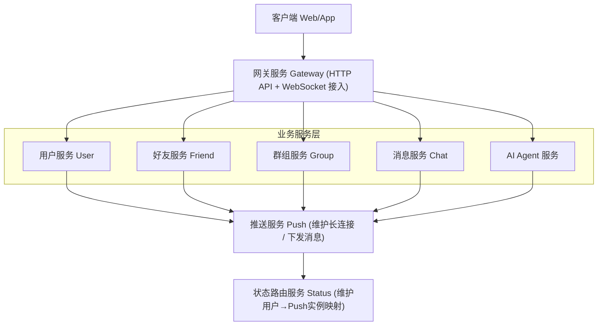

# 项目草稿：分布式AI即时通讯系统 (Distributed AI-IM System)

## 1. 项目定位

**项目名称**：分布式AI即时通讯系统

**一句话描述**：基于 Go-Zero 微服务架构 + Eino AI 框架，构建一个具备高并发能力和 AI 原生功能的即时通讯系统。

**核心亮点**：
- 分布式微服务架构（服务拆分、服务治理、跨节点消息路由）
- AI 原生赋能（智能对话、群聊摘要、RAG 知识库问答）
- 容器化部署（Docker + Docker-Compose）

**学习/开发路径**：以 B 站 Go-Zero IM 实战课程为基础设施底座，在此基础上爆改集成 Eino AI 能力。

---

## 2. 技术栈概览

| 分类 | 技术选型 |
| :--- | :--- |
| **语言** | Go 1.21+ |
| **微服务框架** | Go-Zero（含 goctl 代码生成、服务治理） |
| **AI 应用框架** | Eino（字节跳动开源，LLM Agent/Chain 编排） |
| **服务注册/配置中心** | etcd |
| **消息队列** | Kafka |
| **缓存** | Redis |
| **数据库** | MySQL（业务数据）+ 向量数据库（RAG，如 Milvus） |
| **长连接** | WebSocket (gorilla/websocket) |
| **监控/链路追踪** | Prometheus + Grafana + Jaeger |
| **部署** | Docker + Docker-Compose |

---

## 3. 分布式架构（服务拆分）

所有服务注册到 **etcd** 实现服务发现，服务间通过 gRPC 通信。

## 4. 核心功能模块

### 基础 IM 功能（来自课程底座）
- 用户注册/登录（JWT 鉴权）
- 好友关系链（添加/删除/列表）
- 群组管理（创建/解散/成员管理）
- 单聊 & 群聊（文本/图片消息）
- 消息历史记录与拉取
- 离线消息（上线后自动拉取）
- 多端同步

### AI 增强功能（爆改核心）

| 功能 | 简介 | Eino 实现方式 |
| :--- | :--- | :--- |
| **@AI 智能助手** | 群聊/私聊中 @AI 进行问答或执行任务 | ReAct Agent + Function Calling（调用外部工具） |
| **群聊智能摘要** | 自动生成群聊消息摘要，帮助成员快速跟上进度 | Summarization Middleware |
| **RAG 智能客服** | 基于私有知识库（文档/手册）的精准问答 | Retriever + ChatModel Chain + 向量数据库 |
| **消息语气优化** | 将用户输入改写为更礼貌/专业/幽默的语气 | Chain（Prompt Template + LLM） |
| **多语言翻译**（可选） | 消息自动翻译为目标语言 | 语言检测 + 翻译 Chain |

---

## 5. 核心分布式挑战与解决方案

| 挑战 | 解决方案 |
| :--- | :--- |
| 用户分布在不同的 Push Service 节点，消息如何路由？ | Status Service 维护用户映射关系，提供查询接口 |
| 服务实例动态变化（扩容/重启），如何感知？ | 基于 etcd 的服务注册与发现，Go-Zero 自动处理 |
| 消息是否可靠送达？ | 客户端消息携带唯一 ID，服务端做幂等校验，ACK 确认机制 |
| 高并发下如何削峰填谷？ | 引入 Kafka 异步处理离线消息，解耦业务逻辑 |
| 分布式服务如何监控？ | Prometheus 采集指标，Jaeger 链路追踪 |

---

## 6. 开发阶段规划

| 阶段 | 任务 |
| :--- | :--- |
| **Phase 1** | 跟着公开课程搭建 Go-Zero 微服务骨架，跑通用户、好友、群组、消息基础功能 |
| **Phase 2** | 实现 WebSocket 长连接 + Status Service 路由，完成实时消息推送链路 |
| **Phase 3** | 引入 Kafka，实现离线消息异步处理，完善消息可靠性 |
| **Phase 4** | 新增 AI Agent Service，接入 Eino + LLM，实现 @AI 基础对话 |
| **Phase 5** | 实现群聊摘要 + RAG 智能客服（需要向量数据库） |
| **Phase 6** | 容器化部署（Docker-Compose），接入监控，编写项目文档 |
