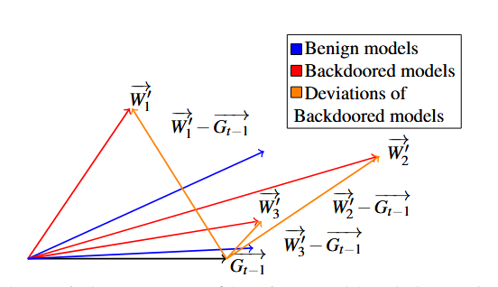

# FLAME Taming Backdoors in Federated Learning 阅读记录
原文链接:https://www.usenix.org/system/files/sec22-nguyen.pdf

## BG
联邦学习通过客户端本地训练、服务器聚合模型的方式，在不直接共享原始数据的情况下实现协同训练，但客户端上传的模型更新可能被攻击者利用，从而引入投毒攻击。其中，后门攻击能够使全局模型在正常输入上保持正常表现，而在带有特定触发器的输入上产生攻击者指定的错误预测，因此具有较强的隐蔽性。现有后门防御方法主要包括基于异常检测的模型过滤和基于差分隐私的噪声防御，但前者通常依赖特定的攻击方式或数据分布假设，后者又存在噪声水平难以确定的问题，噪声过小无法消除后门，噪声过大则会损害正常模型性能。因此，本文提出的**FLAME 希望通过模型聚类过滤、模型裁剪和自适应加噪相结合，在消除后门的同时尽可能保持正常模型性能，并提高防御方法对不同攻击方式和数据分布的适应能力。**

## 相关知识
### 联邦学习中的后门攻击
从**攻击想达到什么效果**的角度来看可以划分成**有目标投毒**和**无目标投毒**。本文从另一个角度**投毒位置/方式**引出了**数据投毒**和**模型投毒**。

**数据投毒**：攻击者通过控制部分客户端，篡改其训练数据。
- 修改 / 翻转数据标签；
- 在样本中加入特定触发器（如特定像素图案），并配合标签修改。

核心思想：改数据，让模型学到错误的关联。

**模型投毒**：攻击者需要能够控制部分客户端，不仅可以投毒训练数据，还可以进一步操纵客户端的模型训练过程和最终上传的模型更新。
- 放大 / 缩小模型更新：增强后门效果，或者降低恶意更新的异常程度；
- 约束训练过程：让恶意模型尽量接近正常模型，从而规避服务器的异常检测。

核心思想：修改参数的同时尽量伪装成正常的迭代更新

### HDBSCAN
HDBSCAN 是一种基于密度的聚类算法，可以根据数据点之间的距离和密度自动划分不同的聚类，并将无法归入任何聚类的点视为异常点.

### Differential Privacy (DP)
差分隐私是一种保护数据隐私的技术，通过在算法输出中加入随机噪声，降低推理攻击的成功率；同时，噪声也能在一定程度上削弱后门影响，但过强的噪声可能影响良性模型的性能。

## 攻击模型
**攻击者的目标**：让全局模型在**带有攻击者指定触发器的输入**上产生错误的、攻击者指定的预测结果。除了触发器输入之外，模型在其他正常输入上的行为应尽可能与正常模型一致，同时恶意模型更新与正常模型更新的距离不能太大，以避免被服务器的异常检测机制发现。

**攻击者能力**：假设：
- 可以控制 $k < \frac{n}{2}$个恶意客户端； 可以控制这些恶意客户端的**训练数据、训练过程和模型参数**；
- 知道服务器的**聚合过程以及可能使用的防御方法**；但是**不能控制服务器和正常客户端**。

## 防御目标
1. **Effectiveness**：能够有效消除恶意模型更新对全局模型的后门影响，使聚合后的全局模型不再表现出后门行为。
2. **Performance**：在消除后门的同时，尽可能保留全局模型在正常任务上的性能，避免防御措施影响模型的正常使用。
3. **Independence from data distributions and attack strategies:** 防御方法应具有较强的通用性，**不依赖于提前知道具体的后门攻击方式，也不应对客户端的数据分布做特定假设**，例如不要求数据必须是 IID 或 Non-IID。

## 后门模型特征
本文将每个客户端模型的参数**拉平成一个权重向量**，并从两个维度描述模型更新：
1. **方向（Direction）**：模型更新方向是否偏离正常客户端；
2. **大小（Magnitude）**：模型更新幅度是否异常。

由于后门攻击会改变模型参数，恶意模型与正常模型之间可能在模型更新的**方向和大小**上产生不同程度的差异。如下图所示可能角度偏大方向不太一样，可能大小不一样，也可能都与正常的相似。

| 类型    | 特征                     | 形成方式                            |
| ------- | ------------------------ | ----------------------------------- |
| **W′₁** | 方向偏差大，大小相近     | 大量投毒数据 / 更多本地训练         |
| **W′₂** | 方向相近，但大小很大     | 放大模型更新                        |
| **W′₃** | 方向和大小都接近正常模型 | 约束训练 / 缩小模型更新，增强隐蔽性 |

## FLAME
### 总览
客户端模型更新 → HDBSCAN 过滤 (找明显异常模型) → Adaptive Clipping (限制更新幅度，防止攻击者放大影响) → 聚合 →  Adaptive Noising (给全局模型加噪声，进一步削弱后门) → 最终全局模型

### 三步走
#### Filtering
动态场景下的模型过滤：后门模型可能在**更新方向**上明显偏离正常模型，而攻击者还可能同时注入多个不同的后门，导致传统的固定聚类方法难以准确区分恶意和正常模型。

传统聚类方法的问题主要有两个：
- 需要预先指定聚类数量，通常将模型划分为固定数量的簇，并假设较小的簇包含恶意模型；
- 面对多个不同后门时，恶意模型可能被分散到不同簇中，甚至与正常模型混在同一个簇中，从而导致检测失败。

FLAME的解决方案:
FLAME 使用基于**余弦距离的 HDBSCAN**进行动态聚类，通过余弦距离关注模型更新的**方向差异**，因此模型即使被攻击者缩放，也不会改变其方向特征。
HDBSCAN 不需要预先指定聚类数量，并将无法归入主要正常簇的模型视为异常点。由于攻击者控制的客户端少于一半，FLAME 假设**最大簇主要由正常客户端组成**，并将其他模型作为潜在恶意模型过滤。

#### Clipping
自适应裁剪：攻击者可能通过**放大模型更新幅度**增强后门影响，而固定的裁剪阈值难以适应不同训练阶段；阈值过大限制不了攻击，过小又会影响正常模型。

FLAME的解决方案：
FLAME 根据**每轮所有客户端模型与上一轮全局模型之间的 L2 距离**计算中位数，将其作为当前轮的**自适应裁剪阈值**。对于超过该阈值的模型更新，FLAME 会将其缩放到阈值范围内，从而限制恶意模型过大的更新幅度，同时尽量减少对正常模型的影响。

#### Noising
自适应加噪：噪声水平难以确定，噪声过小，**后门无法有效消除**；噪声过大，又会**损害正常模型性能**，因此需要找到合适的噪声水平。

FLAME的解决方案：FLAME 根据**客户端模型之间的差异**估计模型的**敏感程度**，并据此确定合适的噪声水平，在聚合后的全局模型上加入**高斯噪声**，进一步削弱后门影响，同时尽量减少对正常任务性能的影响，而且**不需要访问客户端训练数据**。

## Security Analysis（理论/可行性分析）
本章主要对前面提出的**自适应加噪机制进行理论分析**，解释为什么加入适当的高斯噪声能够削弱后门，以及如何确定合适的噪声水平。在后门防御中，噪声水平的选择非常关键：噪声过小可能无法有效削弱或消除后门，而噪声过大又会损害正常模型性能，

传统方法通常需要通过**实验评估或经验调参**来确定合适的噪声水平。本文首先引入**敏感度（Sensitivity）** 这一概念，用于衡量数据发生变化时模型可能产生的最大变化，一般来说，模型敏感度越高，需要的噪声也越大。但在联邦学习中，服务器无法直接访问客户端训练数据，因此 FLAME **不依赖客户端训练数据，而是利用客户端模型之间的差异来估计敏感度，并从理论上推导消除后门所需的噪声边界**。同时，进一步分析了前面的 **Filtering 和 Clipping** 对敏感度的影响：二者能够降低恶意模型对全局模型的影响，从而降低所需的噪声水平，减少加噪对正常模型性能造成的损失。
